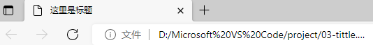

# 【HTML基础】

> 本文档是对 Pink 老师课程的总结归纳及补充，并学习了JERRY-Z-J-R的文档 

# 一、HTML简介

## 1.1 网页

### 1.1.1 什么是网页？

**网站**：利用前端技术制作的网页集合。

**网页**：构成网站的基本元素，通常是 HTML 格式的文件（.htm 或 .html）必须通过浏览器来阅读。

### 1.1.2 什么是HTML?

**超文本**：由图片、声音、动画、视频……构成且可以相互链接的文本。

**HTML**：超文本标记语言（HTML 不是编程语言，而是由一套标记标签构成的标记语言）。

### 1.1.3 网页如何形成

前端代码开发 ——> 浏览器解析、渲染代码 ——> 呈现 Web 页面。

## 1.2 浏览器

### 1.2.1 常用浏览器

**PC 端五大浏览器：** `IE`、`Chrome`、`Firefox`、`Safari`、`Opera`、（目前 IE 已经被 `Edge` 取代）。

### 1.2.2 浏览器内核

**四大浏览器内核：**IE（`Trident`）、Firefox（`Gecko`）、Safari（`Webkit`）、Chrome / Opera / Edge（`Blink` 属于 Webkit 的分支，Blink 兼容 Webkit）

注：目前国内浏览器一般都采用 Webkit / Blink 内核。

## 1.3 Web标准

**W3C**： `万维网联盟`，国际最著名的标准化组织之一。

**Web 标准：**W3C 组织和其他标准化组织为 Web 开发制定的一系列标准的集合。

### 1.3.1 为什么需要Web标准？

浏览器不同，解析渲染显示的页面效果就有些许差异，通过 Web 标准可以统一浏览器解析显示效果，同时大大减少开发者的工作量（一套代码，多种浏览器平台兼容运行）。

遵循 Web 标准除了可以让不同的开发人员写出的页面更标准、更统一外，还有以下优点：

- 让 Web 开发前景更广阔

- 网页能被更广泛的设备访问

- 更容易被搜索引擎搜索（排名靠前）

- 降低网站的流量费用

- 使网站更易于维护

- 提高页面的加载速度

### 1.3.2 Web标准的构成

**主要包括三个方面：** `结构`、`表现`、`行为`。

- **结构**：用于对网页元素进行整理和分类，现阶段主要指的是 `HTML`
- **表现**：用于设置网页元素的版式、大小、颜色等外观样式，主要指 `CSS`
- **行为**：网页模型的定义及交互方式的编写，现阶段主要指的是 `JavaScript`

**Web 标准提出的最佳体验方案：** `结构`、`样式`、`行为` 相互分离。

- **简单的理解**：结构写到 `.html` 文件中、表现写到 `.css` 文件中、行为写到 `.js` 文件中
- **一句话解释**：结构类似身体、表现类似衣服、行为类似动作（结构始终是一切的基础！）

# 二、HTML标签
> 特别提醒：以下内容中，HTML 标签内会出现若干 “标签样式属性”，此处只需要了解即可，因为实际开发中都是使用 CSS 来对 HTML 进行样式设置，一般都不会使用样式属性。

## 2.1 HTML语法规范

### 2.1.1 基本语法概述

HTML 标签是由**尖括号**包围的关键字词，例如：`<html>`。

HTML 标签通常是成对出现的，例如：`<html>` 和 `</html>`，我们称为**双标签**。标签对中的第一个标签是**开始标签**，第二个标签是**结束标签**。

有些特殊的标签必须是单个标签，例如：`<br />`，我们称为**单标签**。注意：`/` 之前有一个空格（Coding Style 编码风格）。每个标签原则上都应该有**结束符**，即：` /`。所以单标签的最后要加 `/` 以表示结束，当然不加也是可以被浏览器正常解析的。

> HTML5 规范中明确说明单标签 `/` 是可以忽略的，**实际开发中建议不要给单标签添加斜线**。

> 任何标签都建议不要大写，即便是 `<!doctype html>` 标签。

### 2.1.2 标签关系

1. **包含关系**

```html
<head>
    <title></title>
</head>
```

2. **并列关系**

```html
<head>
</head>
<body> 
</body>
```

## 2.2 HTML基础结构标签

### 2.2.1 第一个HTML网页

每个网页都会有一个基础的结构标签（骨架标签：4组），页面内容也是在这些基础标签上书写的。

> HTML 页面也称为 HTML 文档。

【HTML 基础结构】

```html
<html>
    <head>
        <title></title>
    </head>
    <body>
    </body>
</html>
```

| 标签名               | 定义     | 说明                                    |
| -------------------- | -------- | --------------------------------------- |
| `<html>` `</html>`   | 根标签   | 页面中最大的标签（最基础的标签）        |
| `<head>` `</head>`   | 头部标签 | 在 head 标签中我们必须要设置 title 标签 |
| `<title>` `</title>` | 标题标签 | 页面自己的网页标题                      |
| `<body>` `</body>`   | 主体标签 | 包含文档的所有内容                      |

**网页 title 示例：**




## 2.3 网页开发工具

- `WebStorm`（生态、智能、收费）
- `VSCode`（免费、插件、轻量）
- `HBuilderX`（国产、跨端开发）
- `Sublime Text`（插件、轻量、收费）
- `Atom`（免费、插件、轻量）
- `Dreamweaver`（可视化、智能、收费）
- `Notepad++`（免费、轻量）
- `Windows 记事本`（坑爹）
- ……

### 2.3.1 文档类型声明标签

`<!doctype>` 文档类型声明，作用是告诉浏览器应该使用哪种 HTML 版本来解析渲染网页。

```html
<!doctype html>
<!-- 当前页面采用 HTML5 版本 -->
```

**注意：**

- `<!doctype>` 声明位于文档最前面的位置，处于 \<html> 标签之前
- `<!doctype>` 文档类型声明标签，不属于 HTML 标签
- 请默认统一指定 HTML5 版本 `<!doctype html>`

### 2.3.2 lang语言种类

用来定义当前网页显示的主语言，书写在 `<html>` 标签内。

- `en` 定义语言为英语
- `zh` 定义语言为中文

简单来说：定义为 `en` 就是面向英文用户的网页，定义为 `zh` 就是面向中国大陆用户的网页。

> `en-GB` 英文（英国）
>
> `en-US` 英文（美国）
>
> `zh-CN` 中文（简体，中国大陆）
>
> `zh-SG` 中文（简体，新加坡）
>
> `zh-HK` 中文（繁体，香港）
>
> `zh-MO` 中文（繁体，澳门）
>
> `zh-TW` 中文（繁体，台湾）

```html
<html lang="zh-CN"> 
</html>
```

> 语言的设置是为了方便 `浏览器搜索推荐` 以及触发 `浏览器翻译功能`，并不是说设置了某类主语言后网页中就不能存在其他类型的语言了。

### 2.3.3 字符集

**字符集：**多个字符的集合，以便计算机能够识别和储存各种文字。

在 `<head>` 标签内，可以通过 `<meta>` 标签的 `charset` 属性来规定 HTML 文档应该使用哪种字符编码。

```html
<meta charset="UTF-8">
```

`charset` 常用的值有：`GB2312`、`BIG5`、`GBK`、`UTF-8`，其中 `UTF-8` 也被称为：万国码，基本包含了全世界所有国家需要用到的字符。

**注意：**字符设置是必须的，否则极大可能引起网页乱码。一般情况下，统一使用 "UTF-8" 编码，尽量统一写成标准的 `UTF-8`，不要写成 "utf8" 或 "UTF8"。

**标准骨架：**

```html
<!doctype html>
<html lang="en">

<head>
    <meta charset="UTF-8">
    <title>Title</title>
</head>

<body>
</body>

</html>
```

### 2.3.4 IE 兼容模式

IE 支持通过特定的 `<meta>` 标签来确定绘制当前页面所应该采用的 IE 版本。除非有强烈的特殊需求，否则最好是设置为 **edge mode**，从而通知 IE 采用其所支持的最新的绘制模式。

```html
<!doctype html>
<html lang="en">

<head>
    <meta charset="UTF-8">
    <meta http-equiv="x-ua-compatible" content="ie=edge">
    <title>Title</title>
</head>

<body>
</body>

</html>
```

## 2.4 HTML常用标签

### 2.4.1 标签语义

**简单的理解：**标签的含义，即：这个标签是用来干嘛的。

### 2.4.2 标题标签 

为了使网页更具有语义化，我们经常会在页面中用到标题标签。

HTML 提供了 6 个等级的网页标题，即：`<h1>` 到 `<h6>`。

```html
<h1>一级标题</h1>
<h2>二级标题</h2>
<h3>三级标题</h3>
<h4>四级标题</h4>
<h5>五级标题</h5>
<h6>六级标题</h6>
```


> 单词 head 的缩写，意为：头部、标题。

**标签语义：**作为标题使用，并且依据重要性递减。

**特点：**

- 加了标题的文字会自动加粗，字号也会依次变大
- 一个标题就独占一行，同一行标题后不会再放置其他任何内容（后期可以通过 CSS 修改）

> 级别越大的标题标签，对网页元素的强调性越强，同时也和浏览器 SEO 优化有关。
>
> 故：标题标签不得滥用，要用在合适的地方！

### 2.4.3 段落和换行标签

在网页中，要把文字有条理地显示出来，就需要将这些文字分段显示，在 HTML 标签中，`<p>` 标签用于定义段落，它可以将整个网页分为若干个段落。

```html
<p>我是一个段落标签</p>
```

> 单词 paragraph 的缩写，意为：段落。

**便签语义：**可以把 HTML 文档分割为若干段落。

**特点：**

- 文本在一个段落中会根据浏览器窗口的大小自动换行

  > 对于中文段落来说无论如何都会自动换行，但是对于英文段落来说如果字母是连续的（aaa...），那么浏览器会认为该段落整体都是一个字母不会自动换行，要想英文段落自动换行字母之间得有空格。

- 段落和段落之间保有空隙（段间距）

- 同一段落里的不同行文字之间也有一定的空隙（行间距）


在 HTML 中，一个段落中的文字会从左到右依次排列，直到浏览器窗口的右端，然后才自动换行。

如果希望某段文本强制换行显示，就需要使用换行标签  `<br>`。

```html
<br>
```

> 单词 break 的缩写，意为：打断、换行。

**标签语义：**强制换行。

**特点：**

- `<br>` 是个单标签
- `<br>` 标签只是简单地开始新的一行，跟段落不一样，所以不会产生段间距

分割线标签：`<hr>`。

```html
<hr>
<!-- 某些时候需要对内容块进行分割时会用到分割线标签 -->
```
